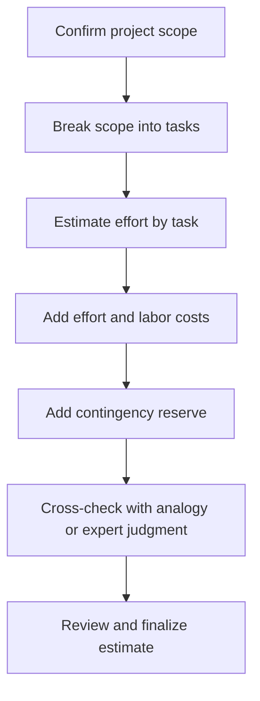
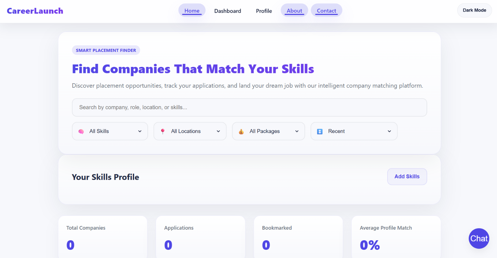
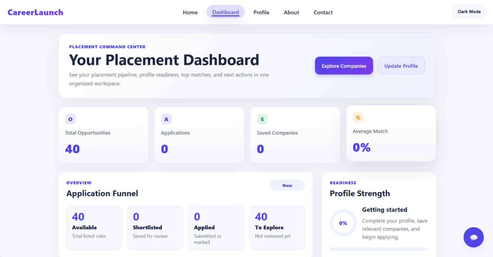

# Experiment 10: Software Project Estimation and Scheduling

| Student details | |
|---|---|
| **Name** | Aditya Madhukar Mane |
| **Roll No.** | A102 |
| **Subject** | Software Engineering |
| **Project** | Placement Finder |
| **Project link** | [Placement Finder](https://placement-finder.netlify.app/) |

**Experiment:** Compare and contrast different software project estimation and scheduling techniques.

## 1. Aim

To compare software project estimation and scheduling techniques and apply suitable methods to estimate the effort, implementation cost, and timeline for the Placement Finder project.

## 2. Project overview and assumptions

Placement Finder is treated as a web application that helps candidates find placement opportunities. The assumed project scope includes:

- A responsive interface for candidates
- Candidate registration and profile management
- Placement listings with search and filters
- Saved opportunities or an application feature
- An administrator interface to manage listings
- Database and application logic, testing, and deployment

## 3. Estimation techniques: comparison and contrast

Project estimation predicts required work, cost, resources, or duration. Techniques differ in the information they need, the detail they provide, and how much judgment is involved.

| Technique | How it works | Strengths | Limitations | Use for Placement Finder |
|---|---|---|---|---|
| Expert judgment | An experienced developer estimates from knowledge of similar work. | Fast and useful early. | Subjective; estimators may disagree. | Initial cross-check of the total. |
| Analogy estimation | Compares with a previous similar project and adjusts for differences. | Simple when reliable examples exist. | The comparison may be inaccurate if project scope differs. | Compare with a similar student job portal or listing site. |
| Top-down estimation | Estimates the whole project, then divides the total among major components. | Quick before detailed requirements are known. | May miss small tasks and integration work. | Early budget and feasibility check. |
| Bottom-up estimation | Estimates individual tasks and sums them. | Detailed, traceable, useful for tracking. | Needs a task breakdown and takes longer. | Main estimate after the feature list is agreed. |
| Function-point or size-based estimation | Measures user-visible functions or software size, then converts this to effort using productivity data or a model. | Relates effort to functionality; can be used before coding. | Needs consistent counting rules and comparable productivity data. | Independent check after counting user functions. |
| COCOMO-style estimation | Uses estimated software size and project factors to calculate effort and schedule. | Structured when calibrated. | Depends on suitable size and calibration inputs. | Use if reliable size and project data are available. |

Top-down and expert-based methods are faster but less detailed. Bottom-up estimation is more transparent once tasks are known. Analogy and size-based methods can check whether the bottom-up result is plausible when suitable comparison data exists.

### Estimation workflow



## 4. Scheduling techniques: comparison and contrast

Scheduling organizes work into activities, dependencies, and calendar dates. It must account for task order and which work can happen in parallel.

| Technique | How it works | Strengths | Limitations | Use for Placement Finder |
|---|---|---|---|---|
| Gantt chart | Shows tasks as bars across a calendar timeline. | Easy to read and communicate. | Dependencies and risks can be less visible in large plans. | Present the six-week implementation plan. |
| Critical Path Method (CPM) | Finds the longest chain of dependent tasks; a delay on this chain delays the project. | Highlights activities needing close monitoring. | Usually treats task durations as fixed. | Monitor dependencies from requirements through release. |
| PERT | Uses optimistic, most likely, and pessimistic task durations. | Makes uncertainty explicit. | Duration values still rely on judgment. | Estimate uncertain integration and defect-fixing work. |
| Agile iteration planning | Plans short, prioritized sets of work and updates plans using feedback. | Adapts to change and delivers progress frequently. | Finish date is less certain unless scope is controlled. | Deliver a usable core, then refine features. |

A Gantt chart communicates the calendar plan; CPM highlights dependency-driven delays; PERT represents duration uncertainty. Agile iteration planning is useful when requirements may change.

### Project scheduling dependency flow


Frontend and backend work can overlap after requirements and the data model are agreed. Integration depends on both streams being ready, so delays in either can affect testing and deployment.

## 5. Applied effort and cost estimate

The bottom-up estimate is the baseline. Rates are planning assumptions in Indian rupees per person-day; they are not a vendor quotation or verified market-rate survey.

| Work area | Effort | Assumed rate per person-day | Estimated cost |
|---|---:|---:|---:|
| Requirements and analysis | 5 days | ₹2,500 | ₹12,500 |
| UI/UX design | 6 days | ₹2,500 | ₹15,000 |
| Frontend development | 18 days | ₹3,000 | ₹54,000 |
| Backend and database development | 16 days | ₹3,500 | ₹56,000 |
| Testing and quality assurance | 10 days | ₹2,200 | ₹22,000 |
| Deployment and configuration | 3 days | ₹3,500 | ₹10,500 |
| Project coordination | 5 days | ₹3,000 | ₹15,000 |
| **Subtotal** | **63 person-days** | | **₹1,85,000** |
| Contingency reserve (15%) | | | ₹27,750 |
| **Estimated implementation cost** | | | **₹2,12,750** |

The 15% contingency covers likely rework, integration issues, and small requirement changes. Hosting, domain renewal, paid third-party services, and post-launch maintenance are excluded because providers and plans are unconfirmed.

### Effort distribution plot

Each block represents approximately one person-day.

```text
Requirements & analysis       █████                  5 days
UI/UX design                  ██████                 6 days
Frontend development          ██████████████████    18 days
Backend & database            ████████████████      16 days
Testing & quality assurance   ██████████            10 days
Deployment & configuration    ███                    3 days
Project coordination          █████                  5 days
                              ─────────────────────────────
Total                                                63 days
```

Frontend and backend development account for the largest estimated effort. These work areas should be monitored closely during implementation.

### Cross-check using other estimation approaches

- **Expert judgment:** approximately 60 person-days
- **Analogy estimation:** approximately 58–68 person-days, assuming a comparable small listing application
- **Bottom-up estimate:** 63 person-days
- **Size-based estimate:** requires a feature or function-point inventory and a productivity rate from comparable projects; without those inputs, a precise result would be misleading

These rough checks are close enough for an early plan. Bottom-up is the clearest budget basis because it exposes the work areas and assumptions. Revise the estimate after confirming actual features and implementation details.

## 6. Proposed six-week schedule

| Week | Planned activities | Main output |
|---|---|---|
| 1 | Confirm requirements, user roles, and scope. | Agreed feature list |
| 2 | Design screens, data model, and application structure. | Design and technical plan |
| 3 | Build candidate interface and core listing functions; start backend work. | First working features |
| 4 | Complete profile, search/filter, application, and administration functions. | Feature-complete build |
| 5 | Integrate components, test main user flows, and fix defects. | Release candidate |
| 6 | Final testing, deployment, documentation, and handover. | Deployed project |

Frontend and backend work can overlap once requirements and the data model are agreed. The schedule should be reviewed regularly because a delay in either stream can affect integration and testing.

## 7. Conclusion

No single technique is best at every stage. Top-down estimation and expert judgment are quick when requirements are incomplete. Bottom-up estimation gives a clearer task-by-task basis for budgeting. Analogy and size-based methods provide useful checks when comparable project data is available.

For Placement Finder, use **bottom-up estimation for the working budget**, **analogy or expert judgment as a cross-check**, and a **Gantt chart supported by dependency and uncertainty reviews** for scheduling. Under the assumptions in this report, the estimate is **63 person-days**, an implementation cost of **₹2,12,750 including contingency**, and a proposed duration of **six weeks**.

## Project Screenshots

### Placement Finder Home Page



### Placement Finder Dashboard


